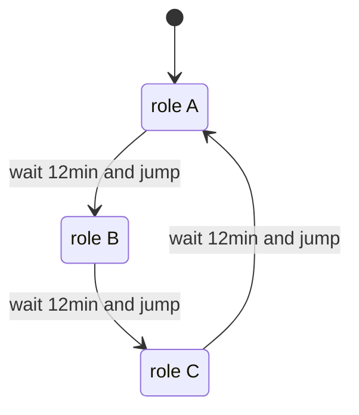
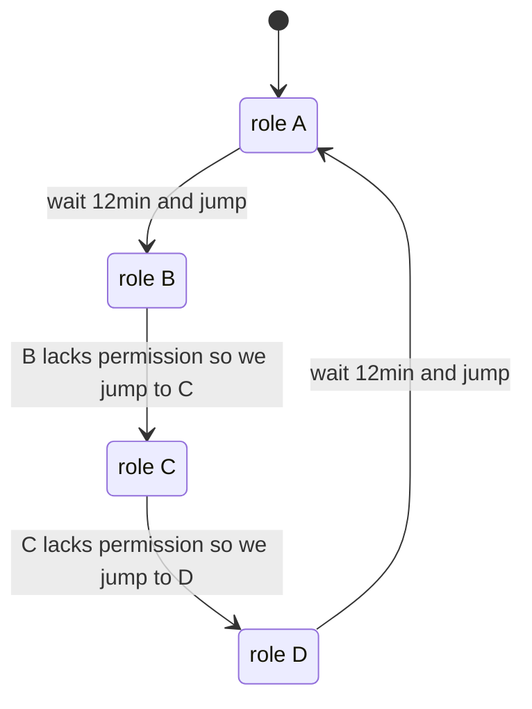

# trick

> **Tactician of Role-Interchanging Cloud Keys** (Effortless AWS persistence via AssumeRole).

> [!NOTE]
> This tool keeps persistence in AWS. It does this by using a pool of AWS IAM roles for AssumeRole operations, set up
> like a ring buffer.

```shell
$ trick -h
Usage of trick
  -config string
        path to config file
  -refresh int
        refresh IAM every n minutes (default 12)
  -region string
        AWS region used for IAM communication (default "eu-west-1")
  -role value
        AWS role to assume (can be specified multiple times)
  -use value
        AWS role with meaningful permissions (can be specified multiple times)
  -verbose
        verbose log output
  -version
        show version
```

### Installation

#### From source

```shell
# via the Go toolchain
go install github.com/wakeful/trick
```

#### Using a binary release

You can download a pre-built binary from the [release page](https://github.com/wakeful/trick/releases/latest) and add it
to your user PATH.


> [!IMPORTANT]
> The `trick-jump-credentials` profile will be updated with new credentials.

> [!WARNING]
> The new credentials need the AWS CLI to be written correctly.

### Simple scenario

```shell
trick -role arn::42::role-a -role arn::42::role-b -role arn::42::role-c
```

<details>
<summary>config file version</summary>

```shell
trick -config path/to/config.hcl
```

```hcl
select_profile = profile.simple

# -region eu-west-1 \
# -role arn::42::role-a -role arn::42::role-b -role arn::42::role-c
profile "simple" {
  chain {
    use {
      arn = "arn::42::role-a"
    }

    use {
      arn = "arn::42::role-b"
    }

    use {
      arn = "arn::42::role-c"
    }
  }
}
```

</details>



### Complex scenario

> [!TIP]
> Sometimes only a few roles in the chain have useful permissions. Instead of waiting for the next jump, we can pick the
> roles that matter to us.

```shell
trick -region eu-west-1 -refresh 12 \
      -role arn::42::role-a -role arn::42::role-b \
      -role arn::42::role-c -role arn::42::role-d \
      -use  arn::42::role-a -use  arn::42::role-d
```

<details>
<summary>config file version</summary>

```shell
trick -config path/to/config.hcl
```

```hcl
# -region eu-west-1 -refresh 12 \
# -role arn::42::role-a -role arn::42::role-b \
# -role arn::42::role-c -role arn::42::role-d \
# -use  arn::42::role-a -use  arn::42::role-d
profile "complex" {
  region = "eu-west-1"

  chain {
    ttl = 12

    use {
      arn  = "arn::42::role-a"
      skip = false # Defaults to false; you can skip it.
    }

    use {
      arn  = "arn::42::role-b"
      skip = true
    }

    use {
      arn  = "arn::42::role-c"
      skip = true
    }

    use {
      arn = "arn::42::role-d"
    }
  }
}
```

</details>


